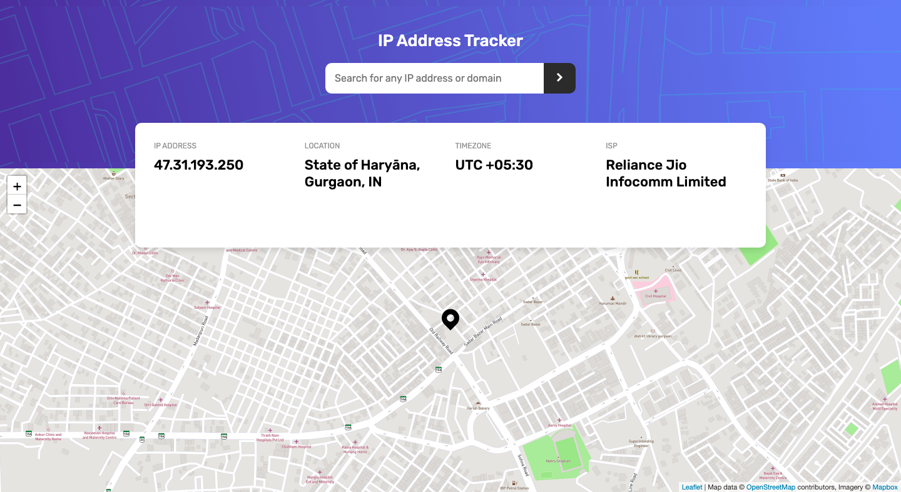
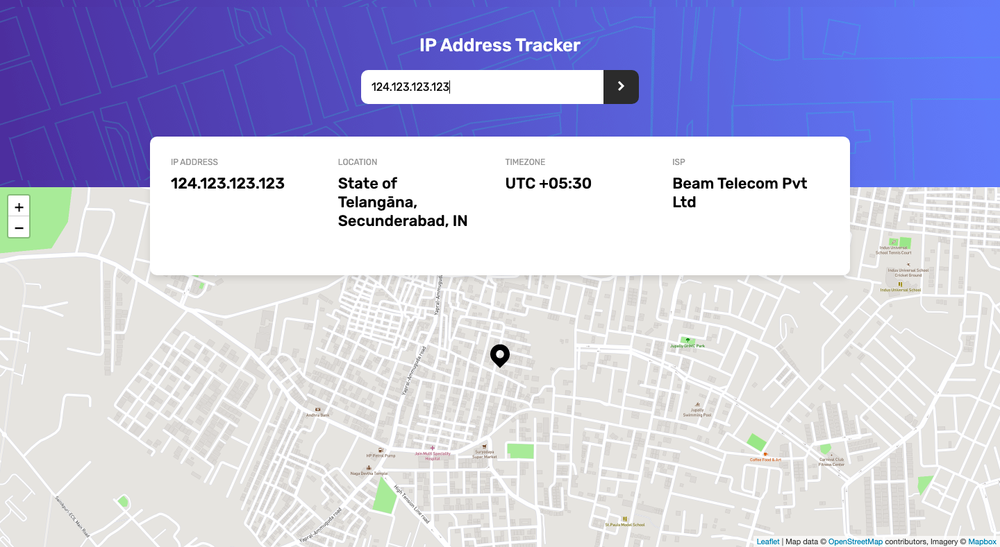

# Frontend Mentor - IP address tracker solution

This is a solution to the [IP address tracker challenge on Frontend Mentor](https://www.frontendmentor.io/challenges/ip-address-tracker-I8-0yYAH0). Frontend Mentor challenges help you improve your coding skills by building realistic projects. 

## Table of contents

- [Frontend Mentor - IP address tracker solution](#frontend-mentor---ip-address-tracker-solution)
  - [Table of contents](#table-of-contents)
  - [Overview](#overview)
    - [The challenge](#the-challenge)
    - [Screenshots](#screenshots)
    - [Links](#links)
  - [My process](#my-process)
    - [Built with](#built-with)
    - [What I learned](#what-i-learned)
  - [Author](#author)

## Overview

### The challenge

Users should be able to:

- View the optimal layout for each page depending on their device's screen size
- See hover states for all interactive elements on the page
- See their own IP address on the map on the initial page load
- Search for any IP addresses or domains and see the key information and location

### Screenshots

### Links

- Solution URL: [Coming soon!](#links)
- Live Site URL: [Coming soon!](#links)

## My process

### Built with

- HTML5 markup
- SCSS - CSS Preprocessor
- Flexbox
- CSS Grid
- Desktop-first workflow
- [React](https://reactjs.org/) - JS library
- [Leaflet JS](https://leafletjs.com/) - Library used for maps
- [IP Geolocation API by IPify](https://geo.ipify.org/) - Discover the precise physical location of a given IP address
- [MapBox](https://www.mapbox.com/) - For getting the map tiles.

### What I learned

I learnt how to use custom hooks in react to encapsulate logic.

I created 2 hooks: one called useMap (functionality of the map & it's location) and another one called useIPGeolocation (functionality of the location API and loading states).

For the tile layers used by Leafletjs, I used mapbox's api.

## Author

- Frontend Mentor - [@sarvagya2545](https://www.frontendmentor.io/profile/sarvagya2545)
